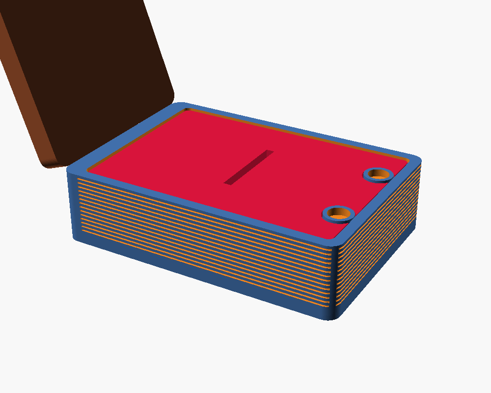

# „Book of Vows" — кутийка за годежен пръстен (3D модел)

Параметричен модел на кутийка за пръстен във формата на малка антична книга.
Проектиран за FDM печат (Bambu Lab H2S). Мерни единици — милиметри.



## Части

| Файл | Какво е |
|---|---|
| `base.stl` | Тялото на „книгата" (тава) с легло за вложката и джобове за магнити |
| `cover.stl` | Предната корица с гравирано „VOWS", рамка и орнаменти |
| `insert.stl` | Вътрешна вложка с процеп за пръстена — флокираш я или обвиваш с кадифе |
| `book_of_vows.scad` | Изходният параметричен модел (OpenSCAD) |

Файлът за печат се избира с параметъра `part` (`"base"`, `"cover"`, `"insert"`).

## Сглобяване

1. **Магнити** (2 бр., Ø6 × 2 mm): залепи по един в джоба на `base` и на `cover`
   (внимавай за полярността — да се привличат). Дават „premium" щракване при затваряне.
2. **Панта**: залепи тясна лента плат/еко-кожа през **гръбчето** (вдлъбнатината на
   ръба X=0) на двете части — точно както при истинска книга-кутия. Гъвкава и здрава.
3. **Вложка**: `insert.stl` се пуска в леглото. Или я **флокираш** (флок-пудра + лепило /
   „velvet spray") за велурен ефект, или я обвиваш с кадифе. Процепът държи халката права.

## Печат (препоръки)

- Материал: PLA или PETG (за мат/премиум вид PLA Matte е чудесен).
- Слой: 0.16–0.20 mm; стени: 3 периметъра.
- Без подпори — всички части лягат плоско.
- Корицата — с текста нагоре, за чист печат на гравюрата (после може боя/фолио в жлеба).
- Запълване: 15–20%.

## Персонализация (в `book_of_vows.scad`)

Редактирай горните параметри:

- `vows_text` — надписът на корицата (напр. име/дата вместо „VOWS").
- `vows_size`, `vows_font` — размер/шрифт на надписа.
- `L`, `W` — размери на кутийката; `base_h`, `cover_h` — височини.
- `slot_w`, `slot_len`, `slot_depth` — процепа за халката.
- `magnet_d`, `magnet_h` — размер на магнитите.

Пре-експорт след промяна:

```bash
for p in base cover insert; do
  openscad -o $p.stl -D "part=\"$p\"" book_of_vows.scad
done
```

## Идеята визуализирана

`renders/` съдържа предпечатни изгледи; `assembly.png` е само за преглед (не се печата
като едно цяло — частите се печатат отделно).
